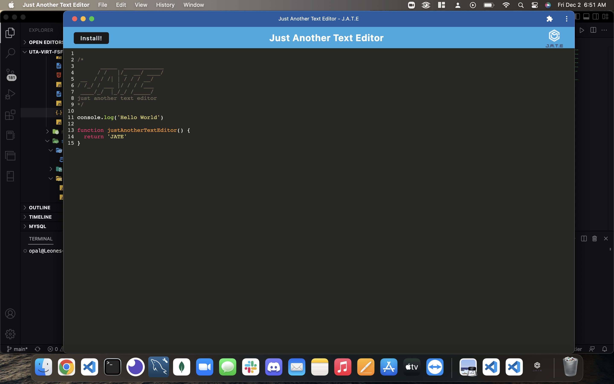

# JATE---PWA

## Description
JATE (short for Just Another Text Editor) is an example of a progressive web application that I built using these technologies.

    Node.JS
    Express.JS
    Webpack
    Workbox
    IndexedDB
    Babel

This website can be utilized both in the browser and as a standalone application on your computer and through its service 
worker, can run both online and offline.

## Demo

View the website here:

https://jate-pwa-lv.herokuapp.com/

>JATE in the browser

>Install prompt

>Jate installed locally on machine

## Installation

In order to install this application, navigate to the website, https://jate-pwa-lv.herokuapp.com/ and click the button labeled `Install!`. This will install the editor to your machine for use offline and outside of your browser.

## Usage

Using this application is pretty easy. 

When on the website or in the locally hosted application, simply begin typing your code. When you want to save a bit of code that you have written, click anywhere on your screen to unfocus your cursor from the line you are writing. This will save your code to the `IndexedDB` through your browser for later retrieval.

## Credits

University of Texas - Austin

[Stackoverflow.com](https://stackoverflow.com)

[Workbox Documentation](https://developer.chrome.com/docs/workbox/)

## License

This repository is licensed under the [MIT](./LICENSE) license.

